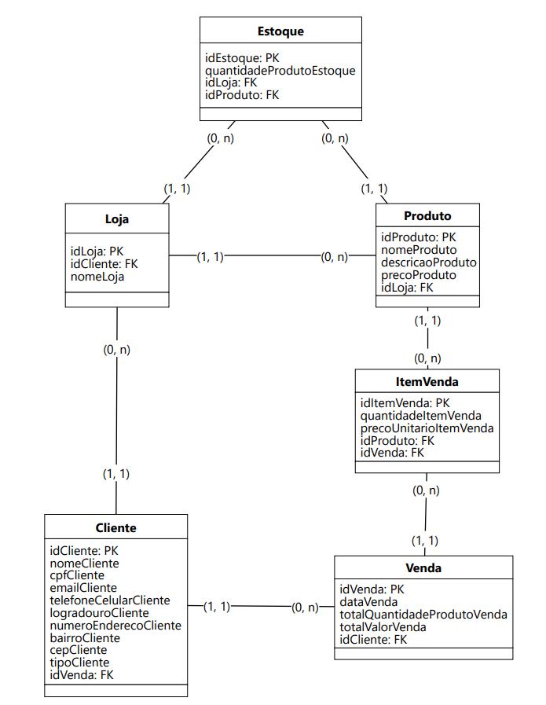
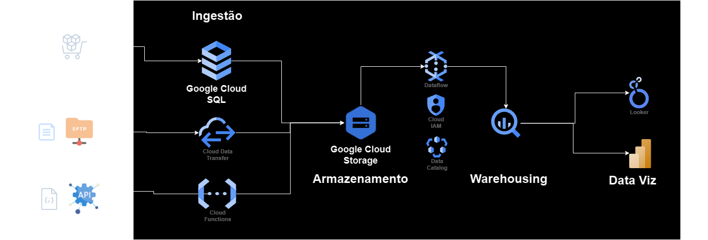

## CENÁRIO - Lançamento de um Marketplace Global de Artesanato
Você foi contratado como Engenheiro de Dados para ajudar a lançar um marketplace global de 
artesanato, onde artistas de todo o mundo podem vender suas criações únicas. Este marketplace 
visa conectar artesãos com clientes globais, oferecendo uma variedade de produtos, desde joias 
feitas à mão até móveis artesanais. Sua missão é projetar e implementar uma infraestrutura de 
dados robusta que suporte todas as operações de negócios, desde o registro de produtos até a 
análise de vendas e promoções.
___
## Tecnologias utilizadas


[//]: # ()

___
O arquivo [dados_fake.py](https://github.com/NicolasEvilasio/marketplace_artesanato/blob/main/dados_fake.py) contém funções que utilizam a biblioteca ``faker`` para gerar dados fictícios e povoar as tabelas
no banco de dados transacional.
___
## Etapa 1 - Modelagem de Dados

A modelagem conceitual, lógica e física podem ser visualizadas com detalhe na pasta
[modelagem_de_dados](https://github.com/NicolasEvilasio/marketplace_artesanato/tree/main/modelagem_de_dados)

## 1.1 - Modelo Lógico
"

___

## 1.2 - Modelo Físico
<details>
    <summary>Clique para expandir</summary>

```postgresql
CREATE TABLE Produtos
(
 idProduto SERIAL PRIMARY KEY,
 categoriaProduto CHAR(50),
 nomeProduto CHAR(50) NOT NULL,
 descricaoProduto TEXT,
 precoProduto FLOAT NOT NULL,
 idLoja INT NOT NULL,
 CHECK (precoProduto > 0)
);
```


```postgresql
CREATE TABLE Estoques
(
 idEstoque SERIAL PRIMARY KEY,
 quantidadeProdutoEstoque INT NOT NULL,
 idLoja INT NOT NULL,
 idProduto INT,
 CHECK (quantidadeProdutoEstoque >= 0)
);
```

```postgresql
CREATE TABLE Clientes
(
 idCliente SERIAL PRIMARY KEY,
 nomeCliente VARCHAR(255) NOT NULL,
 cpfCliente CHAR(11) NOT NULL,
 emailCliente VARCHAR(255) NOT NULL,
 telefoneCelularCliente INT NOT NULL,
 logradouroCliente VARCHAR(255) NOT NULL,
 numeroEnderecoCliente VARCHAR(10),
 bairroCliente VARCHAR(255) NOT NULL,
 cepCliente CHAR(8) NOT NULL,
 tipoCliente VARCHAR(9) NOT NULL DEFAULT 'comprador',
 UNIQUE (cpfCliente,emailCliente,telefoneCelularCliente)
);
```

```postgresql
CREATE TABLE Vendas
(
 idVenda SERIAL PRIMARY KEY,
 dataVenda DATE NOT NULL,
 totalQuantidadeProdutoVenda INT NOT NULL,
 totalValorVenda FLOAT NOT NULL,
 idClienteVendedor INT NOT NULL,
 idClienteComprador INT NOT NULL,
 CHECK (totalQuantidadeProdutoVenda > 0 AND totalValorVenda >= 0)
);
```

```postgresql
CREATE TABLE ItensVenda
(
 idItemVenda SERIAL PRIMARY KEY,
 quantidadeItemVenda INT NOT NULL,
 precoUnitarioItemVenda FLOAT NOT NULL,
 idProduto INT NOT NULL,
 idVenda INT NOT NULL,
 CHECK (quantidadeItemVenda > 0 AND precoUnitarioItemVenda >= 0)
);
```

```postgresql
CREATE TABLE Lojas
(
 idLoja SERIAL PRIMARY KEY,
 idCliente INT NOT NULL,
 nomeLoja VARCHAR(255) NOT NULL
);
```

```postgresql
ALTER TABLE Produtos ADD FOREIGN KEY(idLoja) REFERENCES Lojas (idLoja);
ALTER TABLE Estoques ADD FOREIGN KEY(idLoja) REFERENCES Lojas (idLoja);
ALTER TABLE Estoques ADD FOREIGN KEY(idProduto) REFERENCES Produtos (idProduto);
ALTER TABLE Vendas ADD FOREIGN KEY(idClienteVendedor) REFERENCES Clientes (idCliente);
ALTER TABLE Vendas ADD FOREIGN KEY(idClienteComprador) REFERENCES Clientes (idCliente);
ALTER TABLE ItensVenda ADD FOREIGN KEY(idProduto) REFERENCES Produtos (idProduto);
ALTER TABLE ItensVenda ADD FOREIGN KEY(idVenda) REFERENCES Vendas (idVenda);
ALTER TABLE Lojas ADD FOREIGN KEY(idCliente) REFERENCES Clientes (idCliente);
```
</details>

___

## Etapa 2 - Arquitetura de Data Lake

A arquitetura do Data Lake em Nuvem que integra o banco de dados do marketplace com fontes de dados externas.   
As fontes externas sao:
- Arquivos CSV em um diretório SFTP
- JSON recebido por meio de um evento de webhook

O provedor de Cloud escolhido foi a GCP  


___

## Etapa 3 - Transformação de Dados
<details>
    <summary>Clique para expandir e visualizar o código SQL</summary>

```postgresql
WITH faturamento_por_vendedor AS (
	SELECT
		v.idvenda AS id_venda,
		v.datavenda AS data_venda,
		v.idclientevendedor AS id_vendedor,
		c.nomecliente AS nome_vendedor,
		v.idclientecomprador AS id_comprador,
		iv.iditemvenda AS id_item_venda,
		iv.quantidadeitemvenda AS quantidade_item_venda,
		iv.idproduto AS id_produto,
		p.categoriaproduto AS categoria_produto,
		p.nomeproduto AS nome_produto,
		p.precoproduto AS preco_unitario_produto
	FROM
		public.vendas v
	LEFT JOIN
		public.itensvenda iv ON iv.idvenda = v.idvenda
	LEFT JOIN
		public.produtos p ON p.idproduto = iv.idproduto
	LEFT JOIN
		public.clientes c ON c.idcliente = v.idclientevendedor
)
SELECT
	EXTRACT (YEAR FROM data_venda) AS ano_venda,
	id_vendedor,
	nome_vendedor,
	SUM(quantidade_item_venda * preco_unitario_produto) AS faturamento
FROM
	faturamento_por_vendedor
GROUP BY
	ano_venda,
	id_vendedor,
	nome_vendedor
ORDER BY
	ano_venda DESC,
	id_vendedor;
```
</details>

___

## Etapa 4 - Reporting e Data Visualization
