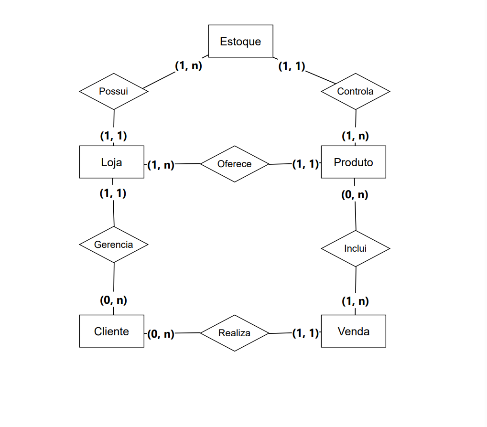

## Documentação do Modelo Conceitual

### Entidades:
1. **Cliente:** Representa os clientes do marketplace. Cada cliente pode ser tanto um comprador quanto um vendedor.
2. **Venda:** Representa as vendas realizadas no marketplace. Cada venda é realizada por um único cliente e pode incluir vários produtos.
3. **Produto:** Representa os produtos disponíveis para venda no marketplace. Cada produto pode estar em várias vendas e várias lojas.
4. **Loja:** Representa as lojas no marketplace. Cada loja é gerenciada por um único cliente e pode ter vários produtos.
5. **Estoque:** Representa o estoque de cada loja. Cada estoque controla a disponibilidade de vários produtos e é possuído por uma única loja.

### Relacionamentos:
1. **Realiza:** Um cliente realiza uma venda. Cada cliente pode realizar várias vendas, mas cada venda é realizada por um único cliente.
2. **Inclui:** Uma venda inclui vários produtos, mas cada produto pode estar em várias vendas.
3. **Gerencia:** Um cliente gerencia uma loja. Cada cliente pode gerenciar uma única loja.
4. **Oferece:** Uma loja oferece vários produtos. Cada produto pode ser oferecido por apenas uma loja. 
5. **Possui:** Uma loja possui um estoque. Cada loja possui um único estoque.
6. **Controla:** Um estoque controla vários produtos. Cada estoque controla um único produto.