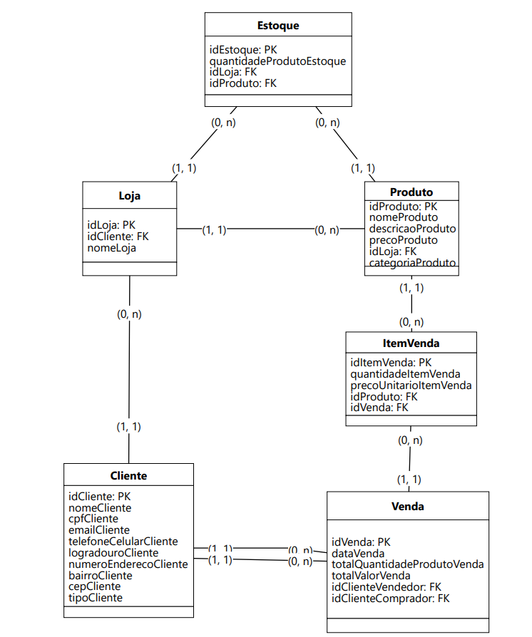

## Documentaçao do Modelo Lógico

___

### Entidades e Atributos:
- **Cliente:**
  - idCliente (PK)
  - nomeCliente
  - cpfCliente
  - emailCliente
  - telefoneCelularCliente
  - logradouroCliente
  - numeroEnderecoCliente
  - bairroCliente
  - cepCliente
  - tipoCliente
  - idVenda (FK)

- **Loja:**
  - idLoja (PK)
  - nomeLoja
  - idCliente (FK)
  
- **Produto:**
  - idProduto (PK)
  - categoriaProduto
  - nomeProduto
  - descricaoProduto
  - precoProduto
  - idLoja (FK)

- **Estoque:**
  - idEstoque (PK)
  - idLoja (FK)
  - idProduto (FK)
  - quantidadeProdutoEstoque

- **Venda:**
  - idVenda (PK)
  - idCliente (FK)
  - dataVenda
  - totalQuantidadeProdutoVenda
  - totalValorVenda
  
- **ItemVenda:**
  - idItemVenda (PK)
  - idVenda (FK)
  - idProduto (FK)
  - quantidadeItemVenda
  - precoUnitarioItemVenda
  
___

### Relacionamentos:
1. Uma loja tem um ou mais produtos.
2. Um produto está em zero ou mais estoques.
3. Um estoque está associado a uma única loja e um único produto.
4. Uma venda contém um ou mais itens de venda.
5. Um item de venda pertence a uma única venda.

___

### Cardinalidade dos Relacionamentos:
- **Loja para Produto:**
  - Uma `Loja` pode ter vários `Produtos` (1:N).
  - Um `Produto` está associado a no máximo uma `Loja` (0:1 ou 1:1).
  
- **Produto para Estoque:**
  - Um `Produto` pode estar em vários `Estoques` (1:N).
  - Um `Estoque` está associado a um único `Produto` (1:1).
  
- **Estoque para Loja:**
  - Um `Estoque` está associado a uma única `Loja` (1:1).
  - Uma `Loja` pode ter vários `Estoques` (1:N).

- **Produto para ItemVenda:**
  - Cada `Produto` pode ser vendido em vários `ItemVenda` (1:N)
  - Cada `ItemVenda` está associado à apenas um `Produto` (1:1)
  
- **Venda para ItemVenda:**
  - Uma `Venda` contém um ou mais `ItemVenda` (1:N).
  - Um `ItemVenda` pertence a uma única `Venda` (1:1).
  
- **Loja para Cliente:**
  - Uma `Loja` pode ter vários `Clientes` (1:N).
  - Um `Cliente` está associado a no máximo uma `Loja` (0:1 ou 1:1).
  
- **Cliente para Venda:**
  -  Um `ClienteComprador` pode estar associado à varias `Vendas` (1:N)
  -  Uma `Venda` pode estar associada à apenas um `ClienteComprador` (1:1)
  -  Um `ClienteVendedor` pode estar associado à varias `Vendas` (1:N)
  -  Uma `Venda` pode estar associada à apenas um `ClienteVendedor` (1:1)